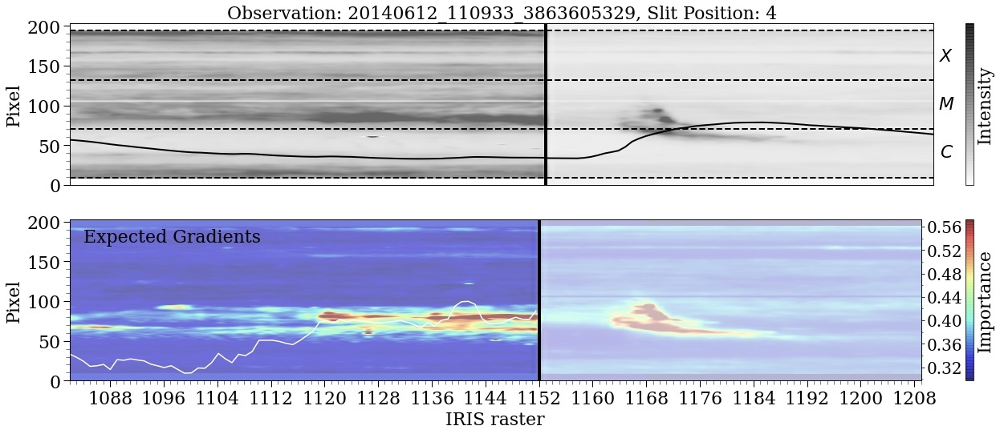

# explainable-ai
We used explainable AI techniques to identify signatures of flare triggering events by training high performance ConvNets on the binary-classification task of distinguishing Mg II spectra generated from active regions that lead to a solar flare and those that did not. After achieving high TSS scores we automatically identified the important features of the positive class using the [Grad-CAM](https://arxiv.org/abs/1610.02391) and [Expected gradients](https://arxiv.org/abs/1906.10670) formalism to generate saliency maps that highlighted the discriminant regions of spectrograms (audio type signals that encode the physics of the solar atmosphere). Grad-CAM leverages the spatial coherency and complex pattern recognition of the final convolutional layers of our network, forming a coarse weighted sum of the most important features. The activations of these feature maps are amplified for patterns that affect the prediction most, and projected back to the resolution of the input spectrum generating a saliency map. Expected gradients on the other hand works at the resolution of the input, using the game theoretic idea of missingness and Shapley values to generate saliency maps. For Expected gradients we used a modified version of the code from the following [Git](https://github.com/suinleelab/attributionpriors) repository. 

***Spectrogram and accompanying saliency map highlighting triplet emission as an important pre-flare signature.***

  

***Light curve and accompanying saliency map indicating regions along the IRIS slit which contribute to a flare prediction.*** 

The models indicate that flows in the form of red and blue wing enhancements, larger intensities, triplet emission, and broad asymmetric spectra all contribute positively to the flare prediction score.
